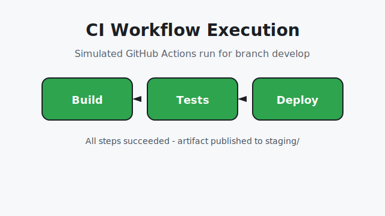

# CodeHealth CI/CD Demo

Este repositório demonstra a configuração básica de um fluxo de Integração Contínua (CI) e Entrega Contínua (CD) com GitHub Actions. O projeto utiliza um pequeno script em Python (`main.py`) acompanhado por testes automatizados para exemplificar validações em cada etapa do pipeline.

## Estrutura de Branches

- **main**: branch de produção, recebe apenas merges revisados a partir de `develop`.
- **develop**: branch de integração contínua onde as funcionalidades consolidadas são preparadas para produção.
- **feature/teste-ci**: branch temporária utilizada para desenvolver e validar melhorias específicas antes do merge em `develop`.

Para simular uma Pull Request, as alterações são desenvolvidas em `feature/teste-ci`, revisadas e então unificadas em `develop`. Somente após a aprovação os commits chegam à `main`.

## Pipeline de CI/CD

O workflow GitHub Actions está definido em [`.github/workflows/ci.yml`](.github/workflows/ci.yml). O pipeline é disparado automaticamente para cada `push` na branch `develop` e realiza as seguintes etapas:

1. **Build** – simula a compilação/empacotamento da aplicação.
2. **Testes** – executa `pytest` validando o script `main.py`.
3. **Relatório** – publica no log o status final (`Build successful` quando todos os testes passam).
4. **Deploy em homologação** – quando os testes são aprovados, um artefato `.zip` é gerado e publicado na pasta `staging/`, simulando a entrega em um ambiente de homologação.

A etapa de deploy possui um _gate_ condicional: só é executada se o job de testes for concluído com sucesso. Caso um commit provoque falha nos testes, o pipeline é interrompido e a etapa de publicação não ocorre.

### Execuções do Workflow



Para testar o comportamento de falhas, basta introduzir uma asserção inválida nos testes (por exemplo, alterar o retorno esperado em `tests/test_main.py`) e realizar um commit na branch `develop`. O job "Run tests" irá falhar, o relatório reportará `Test failed` e nenhuma artefato será publicado. Após corrigir o teste e efetuar novo `push`, o pipeline será executado novamente com sucesso.

## Segurança e Configuração

- O arquivo `config.env` (não versionado) contém variáveis sensíveis como `DB_USER` e `DB_PASS`. Ele está listado no `.gitignore` para evitar que credenciais sejam expostas no repositório.
- Secrets sensíveis, como uma chave de deploy (`DEPLOY_KEY`), devem ser armazenadas via **GitHub Secrets** e consumidas pelo workflow através de variáveis de ambiente (`secrets.DEPLOY_KEY`). Isso mantém as credenciais protegidas mesmo durante execuções automatizadas.

## Reprodução Local

```bash
python -m venv .venv
source .venv/bin/activate  # Linux/macOS
# ou .venv\\Scripts\\activate no Windows
pip install pytest
pytest
python main.py
```

## Reflexão

- **Principal vantagem da Integração Contínua para o trabalho em equipe**: feedback rápido e contínuo sobre a compatibilidade do código, reduzindo conflitos e surpresas na integração final.
- **Riscos de negligenciar a Gerência de Configuração**: versões divergentes, perda de histórico e dificuldade em rastrear mudanças, o que pode gerar retrabalho e falhas em produção.
- **Como a automação aumenta a segurança das entregas**: pipelines automatizados aplicam verificações consistentes (testes, linters, deploys controlados) reduzindo falhas humanas e garantindo rastreabilidade das etapas executadas.
